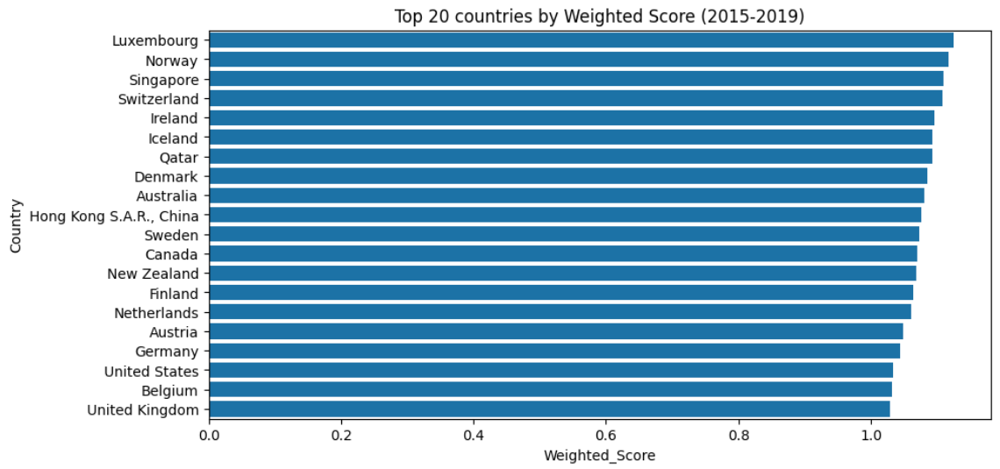
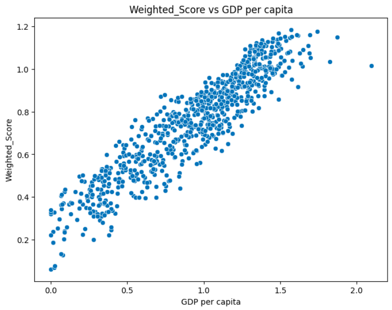
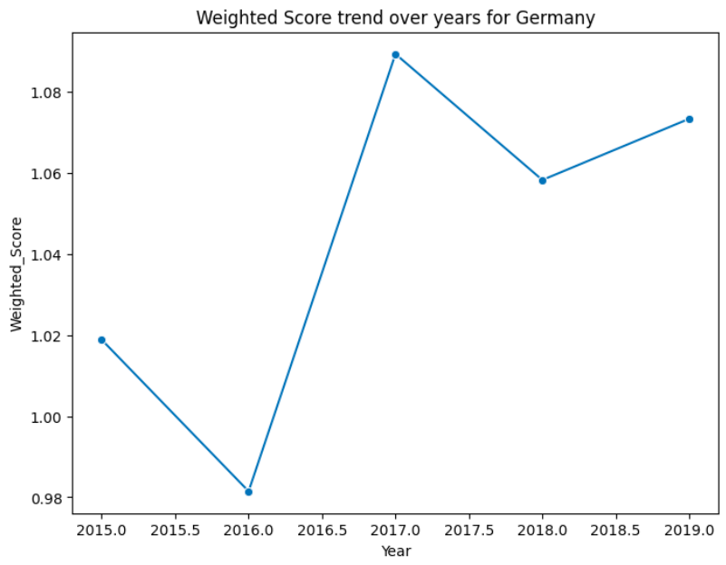

# 🌍 World Happiness Analysis (2015–2019)

## 📌 Problem Statement
This project analyzes **global happiness trends** based on multiple social and economic factors.  
Instead of using the raw "Happiness Score," a **Weighted Score** is computed using these factors:

| Factor | Weight |
|--------|--------|
| GDP per capita | 0.30 |
| Social support | 0.25 |
| Healthy life expectancy | 0.20 |
| Freedom to make life choices | 0.15 |
| Perceptions of corruption | 0.05 |
| Generosity | 0.05 |

This weighted approach provides a **balanced estimate** of happiness across countries and years and allows you to experiment with custom weights.

---

## 📊 Dataset
The dataset comes from the official **[Kaggle World Happiness Report](https://www.kaggle.com/datasets/unsdsn/world-happiness)**.  

- Covers **5 years**: 2015 to 2019.  
- Data is provided as separate CSV files (`2015.csv`, `2016.csv`, …, `2019.csv`).  
- Columns across years were inconsistent → unnecessary ones were removed, and consistent features were kept.  
- Finally, all years were merged into **one unified dataset** for analysis.

---

## ⚙️ Project Structure
The project is organized as follows:

```{raw}

world_happiness/
├── data/                             # Raw datasets (2015.csv – 2019.csv)
├── images/                           # Images used in README/visualizations
├── notebooks/                        # Jupyter / Colab notebooks
│   ├── analysis.ipynb                # Main analysis notebook
│   └── analysis_colab.ipynb          # Colab-ready notebook
├── src/
│   └── happiness/                    # Core Python package
│       ├── __init__.py
│       ├── happiness_handler.py
│       └── happiness_visualizer.py
├── world_happiness.zip               # Zipped folder (src + data) for Colab use
├── requirements.txt                  # Project dependencies
├── pyproject.toml                    # Project build / packaging config
├── .gitignore
├── LICENSE.txt
├── README.md
└── TUTORIAL.md                       # Detailed guide with code (function-by-function)

```

## 🔧 Features & Functionality
The project provides:  

- **Data Handling (HappinessHandler) – Data loading & Metrics**
  - Load yearly datasets (2015–2019)  
  - Clean and merge datasets  
  - Compute Weighted Score  
  - Rank countries & fetch top N countries  
  - Check country-specific ranks and scores  

- **Visualization (HappinessVisualizer) – Plots** 
  - Plot top N happiest countries  
  - Explore correlations between factors (e.g., GDP vs Weighted Score)  
  - Show happiness trend of a specific country over time  

For full function explanations **with code**, see the [TUTORIAL.md](./TUTORIAL.md).  

---

## 🚀 How to Run the Project  

You can run the project in two ways:  

### ☁️ Option A — Google Colab (recommended for a quick start)  
- Open the notebook: **`notebooks/analysis_colab.ipynb`**.  
- The notebook guides you through:  
  - Uploading & unzipping **`world_happiness.zip`** (contains `src/happiness` and `data`).  
  - Running the analysis end-to-end.  
  - Generating rankings, trends, and visualizations.  

### 💻 Option B — Local Machine (VS Code / PyCharm)  

1. Clone or download this repo:  
```bash
git clone https://github.com/Paritosh025/world_happiness.git
cd world_happiness ## to ensure path is correctly defined
```

2. Install dependencies:
```bash
pip install -r requirements.txt
```

3. Open the notebook **`notebooks/analysis.ipynb`** in Jupyter, VS Code, or PyCharm.
4. Ensure that:
   - data/ contains yearly CSVs (2015–2019).
   - src/happiness/ is available (contains the package files).
     
---

⚡ Quick Usage Example

```python
from happiness import HappinessHandler, HappinessVisualizer

# Load data
hh = HappinessHandler(data_dir="data")
hh.compute_weighted_score()

# Get top 10 countries
top_countries = hh.get_top_countries(n=10)
print(top_countries)

# Visualize top 20 countries
hv = HappinessVisualizer(hh.data)
hv.plot_top_countries(n=20)

# Plot trend of Germany
hv.plot_trend(country='Germany')
```

---

### Top 20 countries by chart


### Weighted_Score vs GDP per Capita 


### Germany trend over time


---

## 📊 Interpreting the Results  

- **Higher Weighted Scores** indicate a country is performing better overall across the selected factors, not just in a single area.  
- **Year-to-year changes** highlight how policies, economic events, or other factors influence happiness over time—trend plots help spot stability or sudden shifts.  
- **Correlation plots** show whether improvements in one factor (e.g., GDP per capita) are linked to gains in the overall score.  

---

## ⚠️ Assumptions & Limitations  

- **Weights are heuristic**: The factor weights reflect their assumed importance. They can be adjusted, but they are not learned from the data.  
- **Column changes over time**: Some yearly data columns were renamed or changed slightly. I renamed and standardized them, but small differences may still exist.  
- **Data coverage**: Only countries and years available in the Kaggle datasets are included, so results are limited to that.

---

## 📑 Credits

- **Data**: World Happiness Report (Kaggle).  
- **License**: See `LICENSE.txt` for details.  
- **Docs & How-to**: See `TUTORIAL.md`.

---

## 📜 License

- **MIT License**: See `LICENSE.txt` for details.  

---
