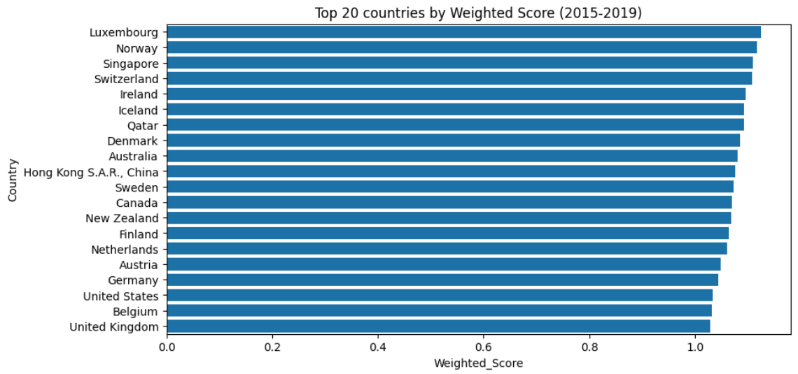
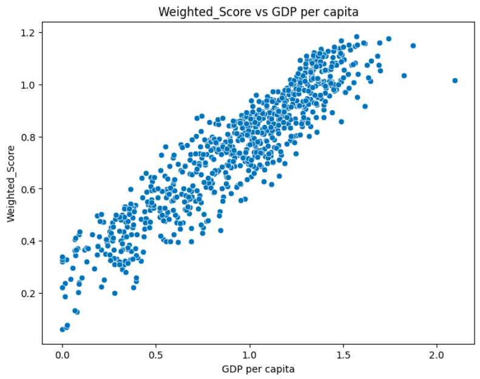
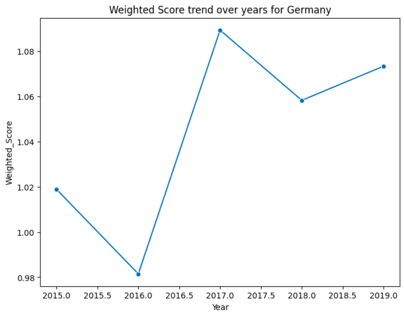

# 🌍 World Happiness Analysis (2015–2019)

> A data analysis project for exploring global happiness trends using World Happiness Report data (2015–2019).

## 📌 Overview

This repository contains a Python package (`happiness`) and notebooks to:
- load yearly World Happiness datasets,
- standardize and combine them,
- compute a custom **Weighted_Score**,
- rank countries and inspect country-level performance,
- generate visual insights using plots.

## 🎯 Problem Statement

Instead of relying only on the raw happiness score, this project computes a custom **Weighted_Score** from key indicators:

| Factor | Weight |
|--------|--------|
| GDP per capita | 0.30 |
| Social support | 0.25 |
| Healthy life expectancy | 0.20 |
| Freedom to make life choices | 0.15 |
| Perceptions of corruption | 0.05 |
| Generosity | 0.05 |

This gives a balanced and customizable view of country happiness across years.

## 📊 Dataset

Source: **[Kaggle – World Happiness Report](https://www.kaggle.com/datasets/unsdsn/world-happiness)**

- Years covered: **2015–2019**
- Raw files: `2015.csv`, `2016.csv`, `2017.csv`, `2018.csv`, `2019.csv`
- Inconsistent yearly columns are standardized before analysis
- Data is merged into one analysis-ready DataFrame

## 🗂️ Project Structure

```text
world_happiness/
├── data/                             # Raw datasets (2015.csv – 2019.csv)
├── images/                           # README plot images
├── notebooks/                        # Jupyter / Colab notebooks
│   ├── analysis.ipynb
│   └── analysis_colab.ipynb
├── src/
│   └── happiness/
│       ├── __init__.py
│       ├── happiness_handler.py      # Data loading, scoring, ranking
│       └── happiness_visualizer.py   # Plotting utilities
├── world_happiness.zip               # Colab-ready zip (data + package)
├── requirements.txt
├── pyproject.toml
├── TUTORIAL.md                       # Function-level guide
├── LICENSE.txt
└── README.md
```

## ✨ Features

### `HappinessHandler`
- Load data year-wise (`load_data`)
- Compute weighted score (`compute_weighted_score`)
- Retrieve top countries (`get_top_countries`)
- Get rank and score for a specific country (`get_country_rank`)

### `HappinessVisualizer`
- Bar chart of top countries (`plot_top_countries`)
- Correlation scatter plot (`plot_correlation`)
- Country trend over years (`plot_trend`)

## 🚀 Getting Started

### Option A: Google Colab
1. Open `notebooks/analysis_colab.ipynb`
2. Upload and unzip `world_happiness.zip`
3. Run notebook cells to reproduce analysis and plots

### Option B: Local

```bash
git clone https://github.com/Paritosh025/world_happiness.git
cd world_happiness
pip install -r requirements.txt
```

Then open and run `notebooks/analysis.ipynb`.

## ⚡ Quick Usage

```python
from happiness import HappinessHandler, HappinessVisualizer

hh = HappinessHandler(data_dir="data")
hh.compute_weighted_score()

top_countries = hh.get_top_countries(n=10)
print(top_countries)

hv = HappinessVisualizer(hh.data)
hv.plot_top_countries(n=20)
hv.plot_trend(country="Germany")
```

## 📈 Sample Visuals

### Top 20 Countries by Weighted Score


### Weighted_Score vs GDP per Capita


### Country Trend Over Time


## 🧠 Interpretation Notes

- Higher `Weighted_Score` means stronger overall performance across selected factors.
- Trend analysis highlights year-to-year stability or shifts.
- Correlation plots help inspect links between economic/social factors and weighted happiness.

## ⚠️ Assumptions & Limitations

- Weights are heuristic (user-defined), not learned by a model.
- Source files vary by year; standardization is applied before analysis.
- Results are limited to available countries/years in the source dataset.

## 📚 Documentation

For detailed, function-by-function explanations and examples, see **[TUTORIAL.md](./TUTORIAL.md)**.

## 📜 License

MIT License — see **[LICENSE.txt](./LICENSE.txt)**.
